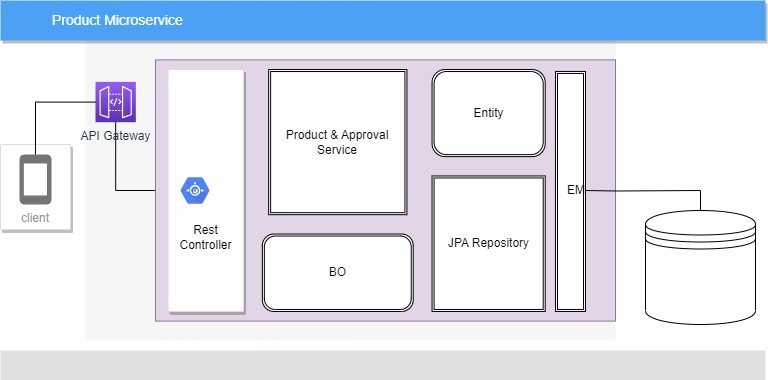

# product_microservice
## Product Specifications
Please follow the below link

## Solution Design

## Database Design

## Application Databas config(application.yaml)
datasource:
    url:      jdbc:mysql://[IP]:[PORT]/productms
    username: <<user>>
    password: <<password>>
## Application OpenAPI document link
http://localhost:8080/swagger-ui/index.html

